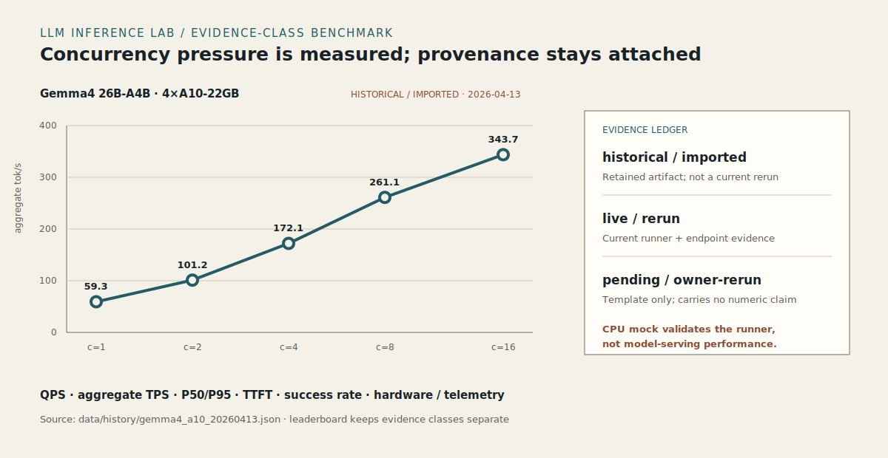

# LLM Inference Lab

> **面向 OpenAI-compatible endpoint 的推理压测：吞吐、时延、并发成功率与硬件证据，全部按 evidence class 分账记录。**
>
> *Benchmark OpenAI-compatible endpoints across throughput, latency, concurrency success, and hardware evidence.*

LLM Inference Lab 提供 endpoint registry、并发 runner、流式 TTFT 测量、
历史数据导入、telemetry 接缝和 evidence-class 排行榜。

*LLM Inference Lab provides an endpoint registry, concurrent runner, streaming TTFT
measurement, history importer, telemetry seam, and evidence-class leaderboard.*

[跑 CPU mock 路径](#quickstart-cpu-mock-smoke) ·
[打开保留排行榜](reports/eval/inference_leaderboard.md) ·
[查看历史来源](data/history/gemma4_a10_20260413.json) ·
[查看 endpoint registry](config/endpoints.example.json)

<p align="center">
  
</p>

## Evidence ledger / 证据台账

| Evidence class | Current receipt | What it proves |
|---|---|---|
| `historical/imported` | Gemma4 4×A10 · c=1/2/4/8/16 · peak 343.7 tok/s | retained 4×A10 benchmark snapshot |
| `live/rerun` | CPU mock · QPS / usage TPS / P50/P90/P95 / TTFT | runner + metrics contract verification |
| `pending/rerun` | 7B / 14B / 26B-MoE endpoint templates | ready-to-run endpoint matrix |

> 343.7 tok/s 峰值是 `historical/imported` 证据，来自保留的 Gemma4 26B-A4B 4×A10 artifact；CPU mock 提供 runner 与指标契约验证。历史导入、实时复跑与待复跑模板严格分账。

实时 token TPS 只在所有成功请求都返回服务端 `usage` 时生成；否则报告写 `n/a`，并用 `token_count_coverage` 显示覆盖率。

## What you can inspect

- Endpoint roles and environment bindings in `config/endpoints.example.json`.
- Concurrent measurements for QPS, usage-backed aggregate TPS, P50/P90/P95, and streaming TTFT.
- JSON provenance attached to historical imports and current runs.
- Markdown leaderboard export that keeps evidence classes separate.
- Optional GPU telemetry seam for a planned GPU rerun.

本仓用于 OpenAI-compatible endpoint 的选型、容量评估与性能回归。
具体覆盖 endpoint 注册、并发压测、telemetry 接缝与 evidence-class 分账。

## Install

```powershell
cd <repo>
python -m venv .venv
.\.venv\Scripts\pip install -e ".[dev]"
```

## Quickstart (CPU mock smoke)

Terminal 1:

```powershell
illab-mock --port 18080
```

Terminal 2:

```powershell
New-Item -ItemType Directory -Force -Path .run\bench\demo\history | Out-Null
illab-import-history --gemma4-md tests\fixtures\gemma4_perf_reference.sample.md `
  --output-dir .run\bench\demo\history
illab-bench --registry config/endpoints.example.json --endpoint mock_local `
  --concurrency 1,4,8 --requests-per-worker 5 --max-tokens 64 `
  --output .run\bench\demo\mock_bench_20260704.json
illab-leaderboard --history .run\bench\demo\history --runs .run\bench\demo `
  --output .run\bench\demo\inference_leaderboard_20260704.md
pytest -q
```

Or run the bundled demo:

```powershell
.\scripts\demo_mock_bench.ps1
# In offline/dev shells with dependencies already installed:
.\scripts\demo_mock_bench.ps1 -UseCurrentPython
```

## Key results (from archived A10 runs)

Historical Gemma4 26B-A4B on 4×A10 (imported from a retained benchmark artifact):

- Peak aggregate throughput: **343.7 tok/s** at concurrency 16
- Output-length sweep: **63.0–66.9 tok/s** with **23–30ms TTFT**; retained single-request scenarios span **39–92 tok/s**

Live mock runs validate the runner on CPU without GPU dependencies.

## Evidence Classes

Leaderboard rows use explicit evidence labels:

| evidence | Meaning | Claim boundary |
|---|---|---|
| `historical/imported` | Imported from retained benchmark artifacts | Useful for interview discussion, not a current live rerun |
| `live/rerun` | Produced by current `illab-bench` execution | May be used as live runner evidence for that endpoint and environment |
| `pending/rerun` | Template or model awaiting a planned GPU rerun | No numeric throughput / latency claim |

Reports summarize four axes: throughput (`qps`, usage-backed `aggregate_tps`, `token_count_coverage`), latency (`P50/P90/P95`, TTFT), memory/hardware (`hardware`, `gpu_telemetry`), and concurrency success (`success_count`, `success_rate`). Historical rows keep their imported hardware note; live GPU memory / power telemetry should be attached only after the planned GPU rerun.

## Endpoint registry

Example registry: [`config/endpoints.example.json`](config/endpoints.example.json)

| endpoint_id | role | env prefix |
|---|---|---|
| `base_7b` | baseline | `ILL_BASE_7B_*` |
| `coach_sft_7b` | SFT | `ILL_SFT_7B_*` |
| `coach_dpo_7b` | DPO | `ILL_DPO_7B_*` |
| `frontier_teacher` | frontier | `ILL_FRONTIER_*` |
| `vllm_7b_a10_template` | planned GPU rerun template | `ILL_VLLM_7B_*` |
| `vllm_14b_a10_template` | planned GPU rerun template | `ILL_VLLM_14B_*` |
| `vllm_26b_moe_a10_template` | planned GPU rerun template | `ILL_VLLM_26B_MOE_*` |
| `mock_local` | CPU smoke | built-in `127.0.0.1:18080` |

Field layout mirrors AlgoCoach `config/endpoint_registry.phase_b.json` but uses `ILL_*` env vars and drops coaching-specific local rule rows.

## vLLM Planned GPU Rerun Recipe

The template endpoints in `config/endpoints.example.json` document suggested A10 reruns without claiming they have been executed. Adjust model paths, ports, tensor parallel size, and context length to the actual server.

Example 7B run:

```powershell
$env:ILL_VLLM_7B_BASE_URL = "http://127.0.0.1:18087/v1"
$env:ILL_VLLM_7B_MODEL = "Qwen/Qwen2.5-Coder-7B-Instruct"
python -m vllm.entrypoints.openai.api_server `
  --model $env:ILL_VLLM_7B_MODEL `
  --served-model-name $env:ILL_VLLM_7B_MODEL `
  --host 0.0.0.0 --port 18087 `
  --tensor-parallel-size 1 `
  --gpu-memory-utilization 0.90 `
  --max-model-len 32768
```

Example benchmark plus telemetry uses two terminals so GPU sampling overlaps the benchmark.

Terminal A:

```powershell
python scripts/sample_nvidia_smi.py --interval 1 --duration 180 --output .run/bench/vllm_7b_a10_telemetry.jsonl
```

Terminal B:

```powershell
illab-bench --registry config/endpoints.example.json --endpoint vllm_7b_a10_template `
  --concurrency 1,4,8,16 --requests-per-worker 5 --max-tokens 256 `
  --output reports/eval/vllm_7b_a10_rerun.json
illab-leaderboard --output reports/eval/inference_leaderboard_latest.md
```

For 14B and 26B MoE, use `vllm_14b_a10_template` and `vllm_26b_moe_a10_template`; the registry records suggested tensor parallel and concurrency levels. Treat all template rows as `pending/rerun` until the JSON report and telemetry artifact exist.

## CLI

| Command | Purpose |
|---|---|
| `illab-mock` | Start mock OpenAI-compatible server |
| `illab-registry` | Print endpoint readiness JSON |
| `illab-bench` | Run benchmark against registry endpoint or `--base-url` |
| `illab-import-history` | Import Gemma4 markdown / qwopus JSON |
| `illab-leaderboard` | Merge history + live runs into Markdown |
| `python scripts/sample_nvidia_smi.py` | Optional no-dependency GPU telemetry sampler for planned GPU reruns |

## Artifact layout

- `reports/eval/` — retained benchmark JSON/Markdown and leaderboards
- `.run/bench/` — per-request detail JSONL (gitignored)
- `data/history/` — imported historical records

## Limitations

当前范围聚焦 benchmark runner、telemetry seam 与 evidence-class leaderboard；调度、集群编排和监控平台不在本仓范围内。

## Tests

```powershell
pytest -q
python -m compileall -q src tests
```

## License

MIT. See [`LICENSE`](LICENSE).
